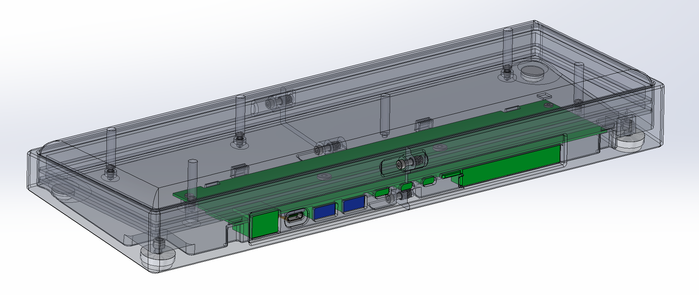
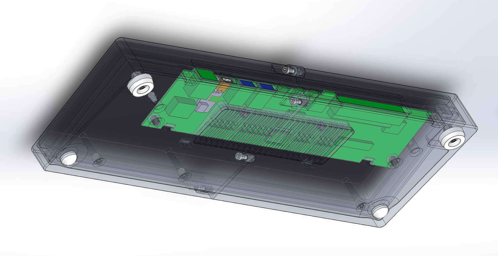
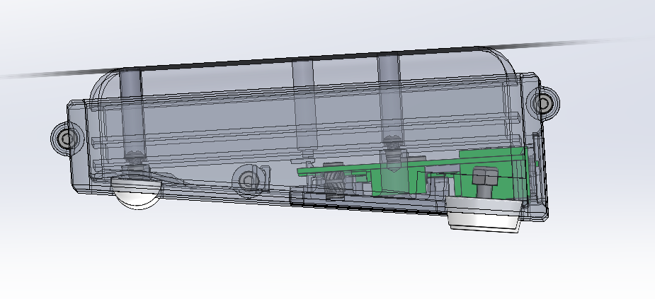

'Raspberry Pi 468' Case model files
---

This repo contains the 3D model files for the RPi 468 case for anyone who wants to 3D print their own.
For more details, see my blog post here: [pvphan.com](pvphan.com)

